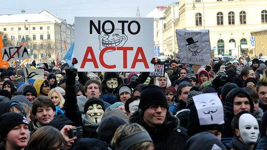
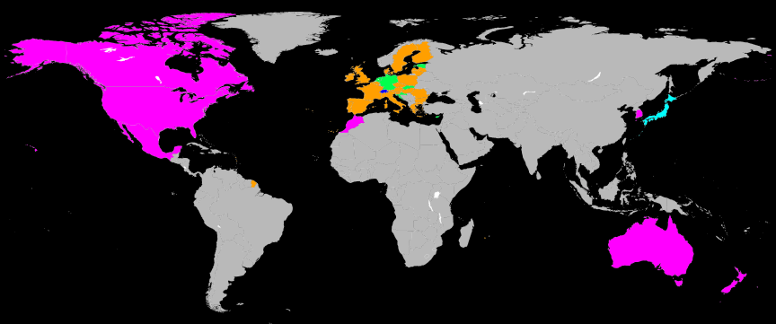
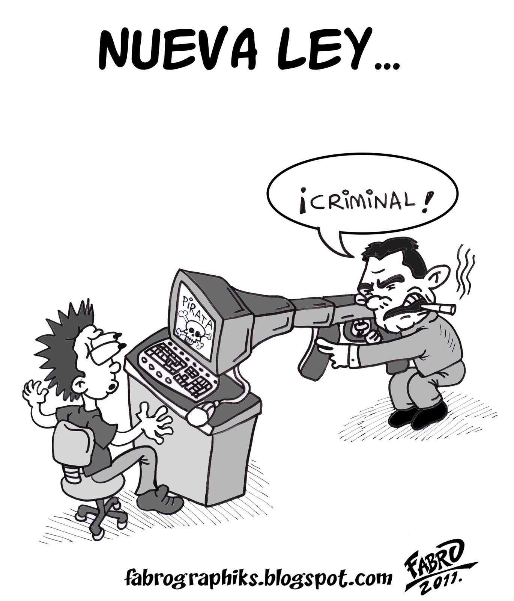
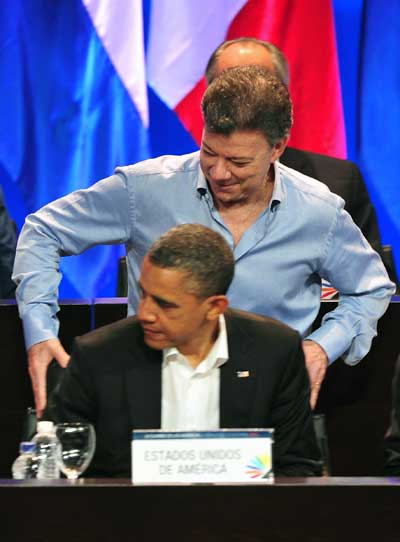

<section id="themes">
	<h2>Configuración de temas</h2>
	

		Temas:  
		<a href="?#/themes">Default</a> -
		<a href="?theme=sky#/themes">Sky</a> -
		<a href="?theme=beige#/themes">Beige</a> -
		<a href="?theme=simple#/themes">Simple</a> -
		<a href="?theme=serif#/themes">Serif</a> -
		<a href="?theme=night#/themes">Night</a>  
		<a href="?theme=moon#/themes">Moon</a> -
		<a href="?theme=solarized#/themes">Solarized</a>
	

</section>

Slide:

#Ley Lleras
#### Manuel Leonardo Mosquera Palomino
1. ###  ACTA
2. ###  Ley Lleras 1
3. ###  Ley Lleras 2
4. ###  Nuveas alertas 
5. ###  Opiniones de la comunidad de Software Libre
6. ###  Conclusiones

Slide: 

Subslide:

##ACTA(Anti-Counterfeiting Trade Agreement)

###Acuerdo Comercial Antifalsificación 
* Impulsada inicialmente por EEUU y Japón en 2006
* Es un Marco legal internacional al cual cualquier país puede adherirse voluntariamente.
* Aumenta la vigilancia fronteriza
* Obliga a los ISP a vigilar los paquetes de datos de sus usuarios
* #### Participantes de negociaciones de este acuerdo:
>* Departamento de comercio de EEUU
>* Comisión Europea
>* Departamento Australiano de Comercio y Asuntos Extranjeros

Subslide:

Subslide:
# Secuelas ACTA

* El capítulo 16 del texto del TLC con EEUU Compromete al país a hacer que sus leyes de propiedad intelectual sean compatibles con las estadounidenses.
* Además de la ley lleras encontramos ejemplos como la ley SOPA y la ley PIPA (EEUU) , ley Doring (México) , ley Sinde (España) que se impulsaron en el mismos contexto del ACTA.
* Estas iniciativas de ley al igual que la ley lleras 1.0 fueron frenadas o desechadas gracias a grandes movilizaciones en la Web.

Slide: 

Subslide:   

#Ley Lleras 1

## [Proyecto de ley 241 de 2011](http://servoaspr.imprenta.gov.co/gacetap/gaceta.mostrar_documento?p_tipo=05&p_numero=241&p_consec=28543)

* Por la cual se regula la responsabilidad por las infracciones al derecho de autor y los derechos conexos en internet.
* Se presenta como exigencia del Plan Nacional de Desarrollo 2010-214 y de los TLC con EEUU y UE.

Subslide:
 
#Ley Lleras 1

## En 2010 se crea la comisión  de propiedad intelectual la cual es la encargada de redactar el proyecto de ley en la cual participan:

* 10 ministros
* Directores del Departamento Nacional de Planeación
* Director de Colciencias
* Director Sena
* Superintendente de industria y comercio

Subslide:

#Ley Lleras 1

## El proyecto de ley fue archivado en abril de 2011

* En gran medida gracias a la importante movilización que se generó en la red por parte de diferentes sectores y grupos.

Slide:

#Ley Lleras 2 

##[Ley 1520 de 2012](http://www.alcaldiabogota.gov.co/sisjur/normas/Norma1.jsp?i=46942)

* Por medio de la cual se implementan compromisos adquiridos por virtud del "Acuerdo de Promoción Comercial", suscrito entre la República de Colombia y los Estados Unidos de América y su "Protocolo Modificatorio, en el Marco de la Política de Comercio Exterior e Integración Económica".

Subslide:

#Ley Lleras 2

* Pasa desapercibida por el congreso y es aprobada el 13 de abril de 2012 sin mayor debate en el congreso y sin mucha visualización en los medios de comunicación y en la opinión pública.

* Su trámite duró solamente 20 días.

Subslide: 

>* La Ley Lleras # 2 es aprobada el 9 de abril de 2012, Obama llegaría a Cartagena el  día13 del mismo mes para firmar la entrada en vigencia del TLC con EEUU.

Subslide:

#Ley Lleras 2

## Contenido

* Aumenta de 50 a 70 años la protección a los derechos de autor de personas jurídicas.
* EL contenido en televisión de contenido nacional pasa a estar garantizado de un 50% a un 30%.
* Prohibición de la retransmisión de señales de tv por internet sin autorización. 
* Considera ilegal la violación o modificación de DRMs (administradores de derechos digitales)
* Esta ley modifica la [ley 23 de 1982](http://www.alcaldiabogota.gov.co/sisjur/normas/Norma1.jsp?i=3431) (sobre derechos de autor) 

Subslide:

#Ley Lleras 2

####En 2012después de la aprobación esta ley fue demandada por el senador Jorge Enrique Robledo por cuestiones de forma y fondo.
####A principios de 2012 la Corte Constitucional la tumbó.
* Forma : Es presentada en la comisión equivocada del senado.
* Fondo: los artículos 13 y 14 son considerados inconstitucionales.
* La corte también argumentó que la normativa iba en contra al derecho a la información y a la educación. 

Slide: 

#Nuevas alertas

* Enero 2014 - La FSF publicó un comunicado en el que denuncia el peligro de las leyes derivadas del TPP (Trans-Pacific Partnership), en el marco del DMCA (Digital Millennium Copyright Act) que se implementarían este año en la legislación estadounidense. 
* Septiembre 2014 - El vicepresidente de estados unidos  Joe Biden acaba de enviar una carta al presidente colombiano Juan Manuel Santos pidiéndole cumplir los compromisos adquiridos en materia de derechos de autor que contempla el TLC con EEUU. 

Slide: 

#Conclusiones

* Políticas como la expresada en la Ley lleras se presentan como simples normas que buscan proteger los derechos de autor, pero terminan abarcando muchos más temas como la transferencia de información y conocimiento.
* El empeño por restringir el uso de internet es una cuestión internacional,  liderada por grandes poderes económicos capaces de influenciar países enteros.
* Iniciativas como el ACTA no han tenido el impacto que sus promotores desearían gracias a las masivas movilizaciones generadas en la Web.
* En el caso colombiano es evidente que los intentos por implementar estas normativas responden a influencias, exigencias y presiones externas.

