<!-- configuracion de colores es opcional pero ultil-->
<section id="themes">
	<h2>Configuración de temas</h2>
	

		Temas:  
		<a href="?#/themes">Default</a> -
		<a href="?theme=sky#/themes">Sky</a> -
		<a href="?theme=beige#/themes">Beige</a> -
		<a href="?theme=simple#/themes">Simple</a> -
		<a href="?theme=serif#/themes">Serif</a> -
		<a href="?theme=night#/themes">Night</a>  
		<a href="?theme=moon#/themes">Moon</a> -
		<a href="?theme=solarized#/themes">Solarized</a>
	

</section>

Slide:

# SEMILLAS LIBRES

Nicolás Gaitán Albarracín

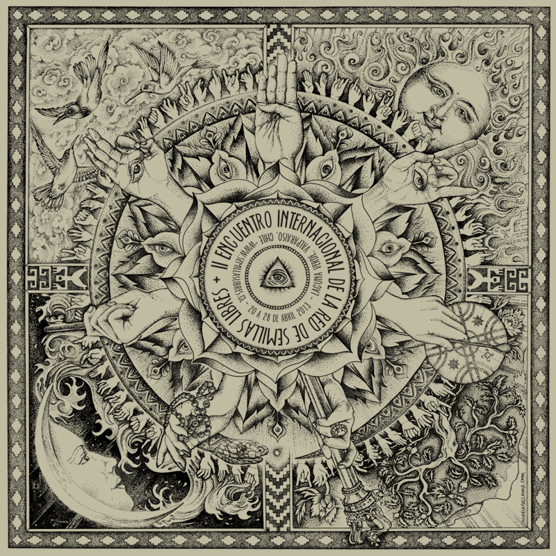

Slide:

# CONTENIDO

## Practicas Ancestrales

## Organismo Genéticamente Modificados

## Revolución Verde

## Monsanto

## Panorama Mundial

## Panorama Colombiano

Slide:

# Practicas Ancestrales

1. La semilla
2. Comunidades
3. Historia
4. Domesticación

Subslide:

# Practicas Ancestrales
## La semilla

* Es el principal **órgano reproductivo** de la gran mayoría de las plantas. Ésta desempeña una función fundamental en la renovación, persistencia y dispersión de las poblaciones de plantas, regeneración de los bosques y es una fuente de alimento básico para muchos animales. 

* Pueden almacenarse vivas por largos períodos, asegurándose así la preservación de especies y variedades de plantas valiosas.

Subslide:
## La semilla

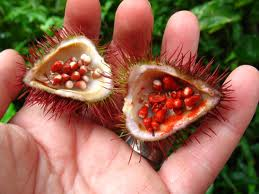

* La conservación de semillas ancestrales se da en los planos de la cultura, la ética, la política y la espiritualidad. <!-- .element: class="fragment" data-fragment-index="3"-->

Subslide:

## Comunidades

* Han sido las comunidades campesinas e indígenas, en especial las personas mayores, y las mujeres quienes han conservado esta sabiduría milenaria hasta nuestros días. <!-- .element: class="fragment" data-fragment-index="1"-->

* Reproducir e intercambiar libre y solidariamente las semillas, decidir cómo y qué cultivar para comer una comida saludable y hacerlo en armonía con la naturaleza, han sido por milenios, las bases de una agricultura orientada a garantizar la soberanía alimentaria de los pueblos y las naciones. <!-- .element: class="fragment" data-fragment-index="1"-->

Subslide:

## Comunidades

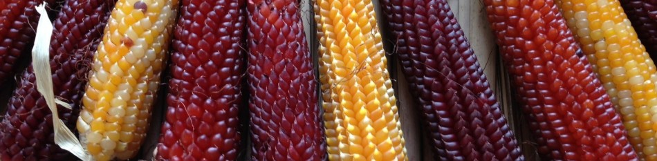

Subslide:

## Comunidades
* Uno de los oficios que existía en la cultura mapuche era el de las curadoras (guardadoras) de las semillas. Una “curadora” es la guardiana de las semillas ya que protege plantas que le han sido encargadas por personas que le han traspasado ese conocimiento, sobre todo en lo que se refiere a medicina y alimentación, y comparte estos conocimientos, como las plantas y semillas con otros para asegurar la continuidad de éstas en la tierra entregándolas responsablemente a personas que sí los van a conservar y mantener para que perduren en el tiempo (Pérez, I. 2011)

Subslide:

## Historia

* Antes del año 8 000 a.C., el trigo era más parecido a un pasto común y corriente que al que hoy conocemos. Se dieron las condiciones para que este antecesor del trigo se cruzara con otro pasto silvestre, dando como resultado un híbrido fértil, capaz de reproducirse y dar origen a semillas viables capaces de germinar y formar plantas, frutos, semillas y así, hacer que esas características perduraran en la naturaleza. 

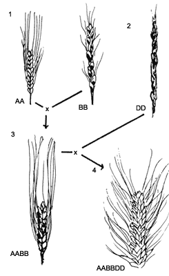

Subslide:

## Historia

* De esta manera se juntaron los catorce cromosomas del antecesor del trigo con los catorce cromosomas del pasto silvestre, produciendo un híbrido conocido como Emmer con 28 cromosomas. Este híbrido tenía semillas mucho más llenas, adheridas a las cubiertas papiráceas, lo cual le daba posibilidades de dispersarse con el viento. Esta nueva planta se cruzó a su vez con otro pasto, dando lugar a un híbrido con semillas aún más llenas, con 42.

Subslide:

Subslide:

## Domesticación

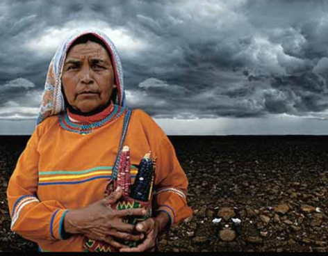

* Una vez domesticada una planta, en la mayoría de los casos se recogen las semillas para volverlas a sembrar y tener una producción de esa planta. 

* Sin embargo, en la mayoría de las plantas que el hombre utiliza para su alimento se usan semillas como en el caso del trigo, maíz, arroz, soya, frijol, lenteja, café, coco, etc. 

* Esto ha creado la necesidad de cosechar y preservar las semillas en buen estado hasta el momento en que se siembren.

Subslide:

## Domesticación

* Con la domesticación de las plantas el hombre creó ambientes permanentes y predecibles que permitieron la invasión de plantas asociadas a los cultivos.

* Existen conjuntos de especies adaptadas a los ciclos agrícolas de cada especie cultivada, que han encontrado en estos ambientes manejados por el hombre sitios para establecerse y reproducirse. 

Subslide:

## Domesticacion

* La avena y al centeno se les consideraba como malas hierbas asociadas al cultivo de trigo y cebada en épocas prehistóricas. En el norte de Europa crecieron mejor que el propio trigo y cebada, por lo que empezaron a ser sembradas intencionalmente y eventualmente fueron domesticadas.

* En el caso de la linaza se han desarrollado malas hierbas con semillas del mismo tamaño que las del cultivo, de modo que en el momento de la cosecha ambas semillas son recolectadas y dispersadas.

Subslide:

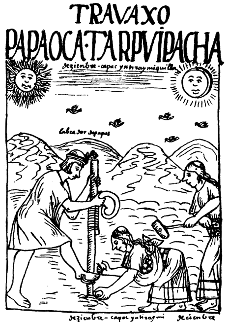
Subslide:

## Domesticacion

* En varias oportunidades se han discutido proyectos a fin de registrar variedades criollas e indígenas con el objetivo de preservarlas, dotarla de valor comercial y permitir que las comunidades puedan percibir beneficios económicos por el “cuidado”, “atesoramiento” de esas variedades. 

* Los cuestionamientos éticos, ponerle valor económico a aquello que no lo tiene, se presentan dificultades a la hora de determinar la comunidad que la mejoró y que debía obtener el beneficio. Se interfieren los mecanismos de ayuda mutua, solidaridad y reciprocidad.

Subslide:

## Domesticacion

* Dificultad de establecer homogeneidad y plasticidad justamente cuando el principal criterio de selección e intercambio en las semillas criollas - es su heterogeneidad, diversidad y adaptación a un territorio especifico.

*  Para muchas comunidades las semillas son sagradas, no pueden constituirse en mercancías, son dones otorgados por Dios o por la naturaleza a los seres humanos.

Slide:

# Organismos Genéticamente Modificados

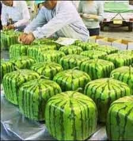

Subslide:

## Organismos Genéticamente Modificados

* Es un organismo al cual su material genético ha sido alterado usando técnicas de ingeniería genética. La ingeniería genética permite modificar organismos mediante la transgénesis o la cisgénesis, es decir la inserción de uno o varios genes en el genoma. 

* Los OGM incluyen micro-organismos como bacterias o levaduras, insectos, plantas, peces, y animales. Estos organismos son la fuente de los alimentos genéticamente modificados, y son ampliamente utilizados en investigaciones científicas para producir otros bienes distintos a los alimentos. 

* 1996 Soya Roundup Ready primer Cultivo GMO aceptado en EEUU 
Principio de Equivalencia Sustancial

Subslide:

## ¿Qué significa la autorización del cultivo de maíz transgénico en el país?

El problema radica en que la siembra de transgénicos involucra contaminación genética porque el maíz se reproduce por polinización cruzada, de acuerdo a la Organización para la Alimentación y la Agricultura de Naciones Unidas (FAO) esto es “el fluido incontrolado de información genética hacia los genomas de organismos de los cuales estos genes no existen en la naturaleza”. La contaminación genética, por ende, afectan a las plantas endémicas y atentan contra su permanencia.

Subslide:

## ¿Qué significa la autorización del cultivo de maíz transgénico en el país?

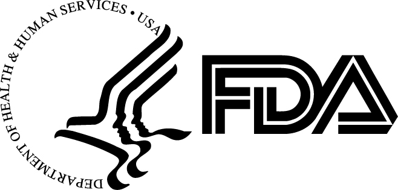

Subslide:

## ¿Qué significa la autorización del cultivo de maíz transgénico en el país?
U S Food and Drug Administration.

Han puesto la pauta para el concepto de OMG en el mundo, el cual fue aprobado entre afanes y presiones politicas.

El Centro para laSeguridad Alimentaria de Washington, reliazo estudio sobre las multiples demandas realizadas por Monsanto por guardar semilla de Monsanto.

Slide:

# Revolución Verde
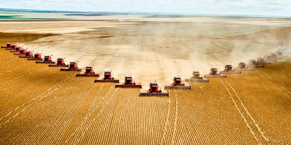

Subslide:

## Revolución Verde

Se denomina al importante incremento de la productividad agrícola. Gran parte de la producción mundial de alimentos de la actualidad se ha logrado gracias a lo que se conoce como Revolucion verde, ocurrida entre 1940 y 1970 en Estados Unidos. 

Utilizar variedades mejoradas de maíz, trigo y otros granos, cultivando una sola especie en un terreno durante todo el año (monocultivo), y la aplicación de grandes cantidades de agua, fertilizantes y plaguicidas. Con estas variedades y procedimientos, la producción es de dos a cinco veces superior que con las técnicas y variedades tradicionales de cultivo.

Subslide:

## Revolución Verde

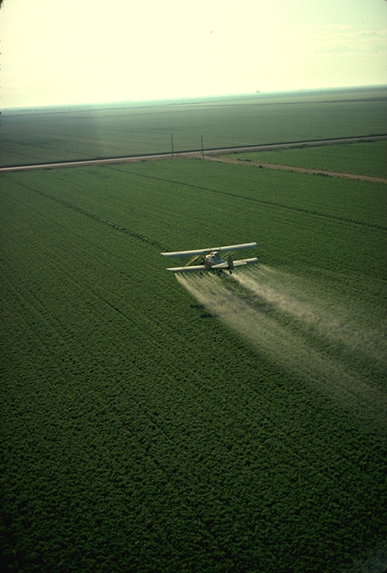

Subslide:

## Revolución Verde

Actualmente la actividad está siendo dominada por grandes empresas quienes toman a la producción de alimentos como una actividad económica más, sin atender a las características y ritmos que la producción agraria requiere, manteniendo además una relación instrumental con los bienes comunes naturales. No es un fenómeno desconocido; por el contario, se trata de una fase envolvente del proceso de modernización agrario, conocido como la Revolución Verde (Souza Casadinho, Javier. 2011) 

Subslide:

## Revolución Verde

La humanidad se encuentra en una encrucijada: producir alimentos para un número creciente de personas y, a la vez, resguardar los bienes comunes naturales. La agricultura moderna basada en monocultivos y el uso de insumos sintéticos determina un importante impacto ambiental, incluido el cambio climático.
En la actualidad nuestro planeta se enfrenta a un proceso crítico respecto a la actividad agraria en general y a la producción de alimentos en particular.

Subslide:

## Revolución Verde

* En los primeros años del siglo XIX, la gran mayoría de los agricultores dependían del abastecimiento propio de sus semillas. Concluida la II guerra mundial, se intensifica la producción agrícola e incrementa la demanda en cantidad y calidad de las semillas. 

* En la actualidad, el mundo desarrollado ha dominado la industria semillera, por las grandes inversiones e investigaciones asociadas que demanda esta actividad, para lograr semillas de calidad con alto potencial productivo en un mercado cambiante y dinámico a nivel internacional. 

Subslide:

## Revolución Verde

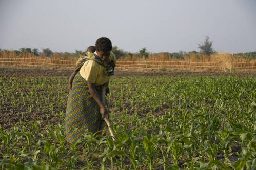

* Estados Unidos posee casi mil instituciones especializadas relacionadas con la actividad de semillas. Otros países como Francia, Japón, Holanda, Inglaterra, Canadá e Israel poseen la mayor fuente de recursos genéticos, para la creación de nuevas variedades e híbridos y ostentan el dominio del comercio de semillas. 

Slide:

# Monsanto
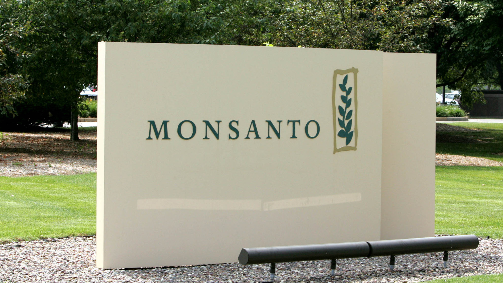

Subslide:
## Monsanto
Monsanto es una proveedora de productos químicos para la agricultura, en su mayoría herbicidas, insecticidas y transgénicos. Entre sus productos más conocidos se encuentran el glifosato bajo la marca Roundup y el maíz genéticamente modificado MON 810.

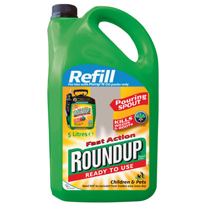

Subslide:
## Monsanto

* Funda en 1901 en San Louis Missouri.
* Fue en 1er lugar una de las mayores empresas químicas del S. XX
* En 1914, distribuía sacarina, para 1938 tenía negocios químicos en el sector de los plásticos y las resinas.
* En 1974 (RonudUp “biodegradable, deja en suelo limpio y es amigable con el medio ambiente) se adentrará en el negocio de los herbicidas y en 1981 se suma a la carrera biotecnológica. 
* En el año 2000 contribuyó a descifrar el código genético del arroz, y anunció que la información obtenida en la investigación sería compartida con la comunidad científica mundial.
Subslide:

# Monsanto
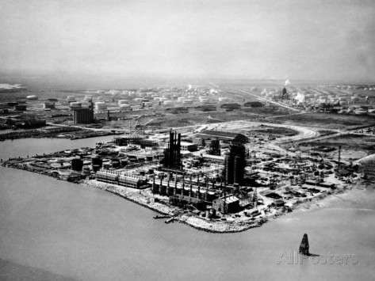

Subslide:
## Monsanto

La compañía genera polémicas alrededor del mundo, debido a múltiples denuncias sobre perjuicios a la salud, impactos ambientales negativos y el desconocimiento acerca de los efectos que podría producir la alteración genética de los alimentos.

Subslide:
## Monsanto

1937 la exposición a PCB provoca efectos toxicos en todo organismo y erupciones cutáneas de tipo ACNE.
1970 se estalla una tubería que transportaba PCB afecta a trabajadores y a vecinos.
1999 compró empresa semillera mas grande India, introdujo semilla BT (Bolgard) supuestamente protege al algodón del gusano americano.

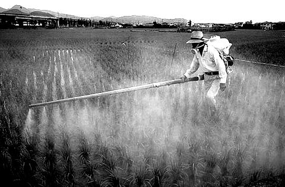

Subslide:
## Monsanto

Agente naranja, aspartamo, hormonas del crecimiento bovino, PCB (Aroclor, Clorofeno, Piraleno).

Policía de los genes, control de cultivos grandes de cereales.

Fomentan mediante denuncias anónimas de granjeros que almacenen semilla1800 Roundup
Entre 1995 y 2005 aquirio mas de 50 empresas de producción de semillas a nivel mundial.

Slide:
# Panorama Mundial

Subslide:
## Panorama Mundial

Internacionalmente, la propiedad intelectual otorga al inventor de una nueva variedad un derecho de propiedad inmaterial que le permite explotar su invención en calidad de obtentor de vegetales.

La obtención de vegetales se encuentra en las manos de un puñado de empresas provenientes particularmente de Estados Unidos, Suiza y Alemania. Monsanto, Dupont y Syngenta, controlan el 47% del mercado (El ETC Group, 2008).

Subslide:
# Panorama Mundial
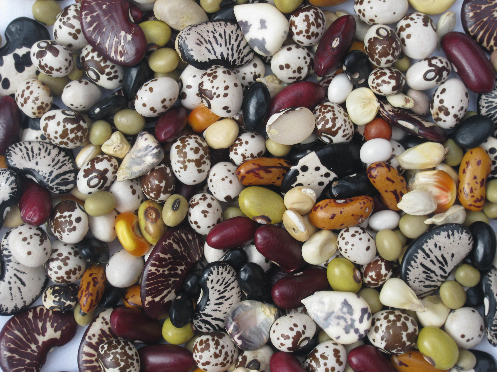

Subslide:
# Panorama Mundial

Desde 1949 los agricultores franceses están obligados a comprar únicamente las semillas registradas en el catálogo nacional de semillas, que a través de un decreto que considera ilegal la comercialización de semillas que no estén incluidas en este documento, les entrega a los grandes productores el poder de apropiarse de las semillas y aniquilar todo tipo de actividades relacionadas con el intercambio.

Subslide:
## Panorama Mundial

Desde que en 1998 India autorizó la entrada de algodón transgénico, miles de campesinos se han suicidado. No pueden pagar la semilla ni los agroquímicos que necesita y ahora ya no pueden combatir ni la supermaleza ni las superplagas que agobian las cosechas. La inviabilidad del modelo Monsanto radica, de acuerdo con Shiva, “en el monopolio que edifican, en el factor económico que persiguen –cultivan productos tóxicos y no alimentos– y en la estupidez, que significa acabar con el legado campesino e inhabilitar a la planta para que use sus defensas naturales”.

Subslide:
## Panorama Mundial
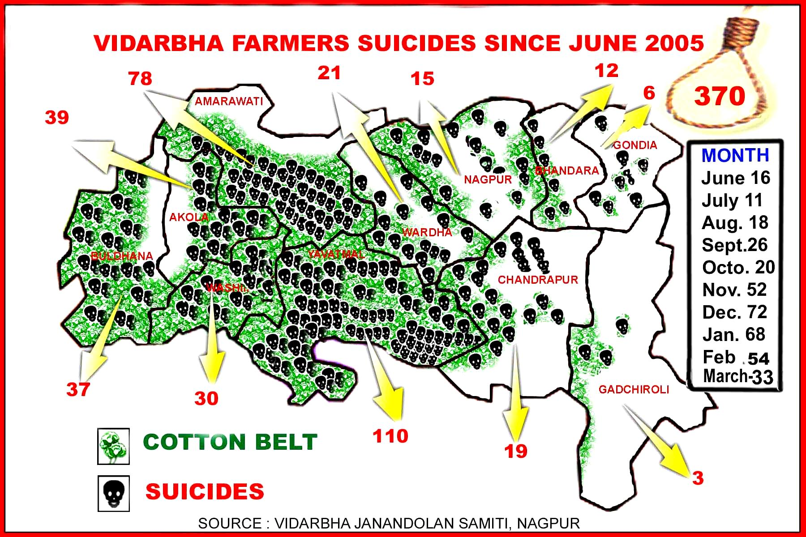

Subslide:
## Panorama Mundial

Ignacio Chapela pudo documentar en 2001, antes de la siembra experimental y piloto de maíz transgénico en el país, que las importaciones de maíz genéticamente modificado estaban alterando de manera definitiva la biodiversidad de maíces en México, centro de origen y diversidad del grano.

Despido de Berkeley

Act-Bio World Campaña de Desprestigio, “Mary Morphy” y “Andura Smetaceck”  distribuyo e-mail de difamación, en la comunidad cnetifica para desligitimar el estudio, inundaron de e-mails a Nature; siguio el protocola de internet.

Subslide:
## Panorama Mundial
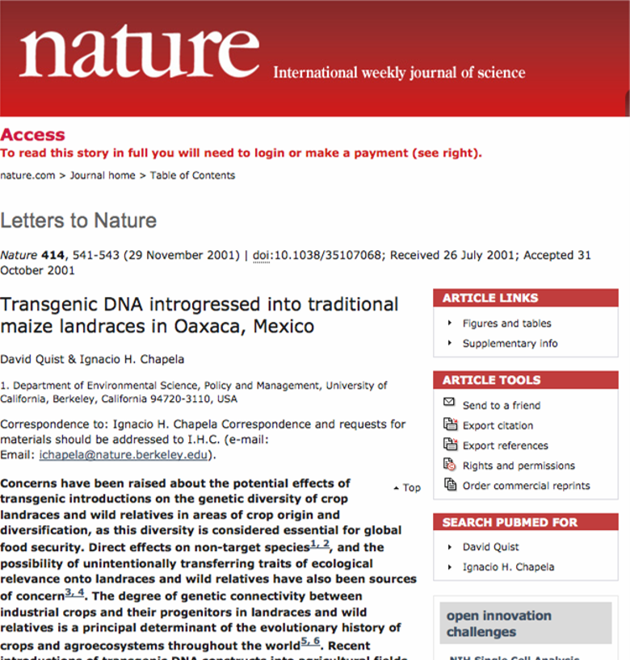

Slide:
# Panorama Colombiano

Subslide:
## Panorama Colombiano

Actualmente, la resolución 970 obliga a los agricultores a almacenar, comercializar, y usar “solo semilla legal”. 

Aunque no define explicitamente qué es una semilla legal, del artículo 15 se deduce que las semillas legales son las certificadas y registradas.

Lo que significa que usar o comercializar las semillas locales es ilegal. 

No en vano, en un comunicado publicado poco después de la resolución, el ICA aclaró que “La normatividad busca ponerle tatequieto a la llamada semilla de costal y a las de contrabando”

Subslide:
## Panorama Colombiano
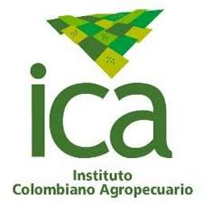

Subslide:
## Panorama Colombiano
Con respecto a la reserva, la 970 permite a los agricultores guardar parte de su propia cosecha para usarla como semilla en una siembra futura, siempre y cuando 

se trate de un agricultor con una extensión máxima de 5 hectáreas (es decir, un pequeño agricultor)
la semilla provenga de una cosecha en que se haya usado una semilla legal
(iii) se use solo para el consumo propio, no para comercializar. Esto significa nuevamente que todos están obligados a usar semilla certificada y que la reserva es un privilegio únicamente de los pequeños agricultores y bajo condiciones estrictas.

Subslide:
## Panorama Colombiano

Subslide:
## Panorama Colombiano

A finales de agosto, pocos días después de iniciado el paro, en la página web del ICA apareció colgada para consulta pública una propuesta de resolución que modifica la 970, pero que ha pasado sorprendentemente desapercibida. Paradójicamente, los cambios que propone le dan la razón a los problemas que el documental, los campesinos y el análisis anterior resaltan. Primero, desaparece por completo el término “semilla legal.” Segundo, aclara explícitamente que tal resolución no aplica para semillas locales y reconoce su uso por comunidades locales. Tercero, permite reservar la cosecha únicamente al pequeño agricultor, pero no le exige que provenga de una cosecha con semilla certificada. 

Subslide:
## Panorama Colombiano

Slide:

# Recursos

* [Documental 970](http://www.youtube.com/watch?v=kZWAqS-El_g)
* [El mundo según Monsanto](http://www.youtube.com/watch?v=LdIkq6ecQGw)
* [Las desigualdades de la resolución 970 del ICA](http://www.elespectador.com/noticias/economia/desigualdades-de-resolucion-970-del-ica-articulo-455404)
* [La 970 y el futuro de las semillas](http://lasillavacia.com/elblogueo/blog/la-970-y-el-el-futuro-de-las-semillas-45626)
* [México centro de origen y diversificación del maíz](http://revoluciontrespuntocero.com/mexico-centro-de-origen-y-diversificacion-del-maiz/)
* [Video: El movimiento contra Monsanto es internacional y transversal, Vandana Shiva](http://www.biodiversidadla.org/Principal/Recursos_graficos_y_multimedia/Video/Video_El_movimiento_contra_Monsanto_es_internacional_y_transversal_Vandana_Shiva)
* [Mecanismos de conservación, cultivo e Intercambio de semillas criollas en manos de los productores, la necesidad de resguardar sus derechos](http://www.rapaluruguay.org/organicos/articulos/Mecanismos_conservacion_cultivo_intercmbio_semillas_criollas.htm)
* [LA CIVILIZACIÓN DE LAS SEMILLAS](http://bibliotecadigital.ilce.edu.mx/sites/ciencia/volumen3/ciencia3/146/htm/sec_13.htm)

